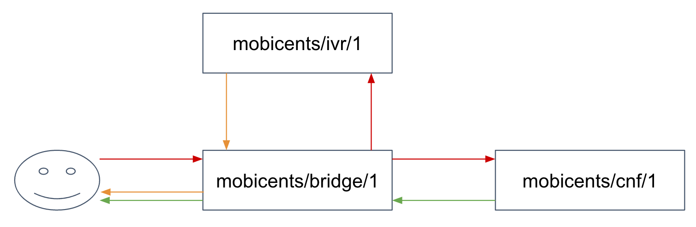

[[_ctms_configuring_the_media_server]]
= Configuring the Media Server

== Network Configuration

.Network configuration
====
[source,xml]
----
<network>
	<bindAddress>127.0.0.1</bindAddress>
	<externalAddress>127.0.0.1</externalAddress>
	<network>127.0.0.1</network>
	<subnet>255.255.255.255</subnet>
	<sbc>false</sbc>
</network>
----
====

==== Address Bindings

*BindAddress* is the address of the network interface to which Media Server is bound to. All RTP channels are open on this address.

*ExternalAddress* is the public address of the server. It is mainly used to patch SDP and to expose SRFLX candidates during ICE negotiation.

==== Network, Subnet and SBC

The Media server can work in two distinct modes: Standard or SBC.

When *sbc* is set to false, the Media Server will establish a channel based on address/port pair it receives from SDP response.
However, if the RTP packet is used within a NAT context, data sent in SDP is the original data and not the NATted IP address/port (this is often the scenario).
Furthermore, when *sbc* is set to false, data will be sent to invalid address and also will not be accepted since Media Server does not know the correct address of the UA.
 
In order to solve NAT issues the *sbc* option must be set to true.
As result, Media Server will wait for first RTP packet; learn its remote IP address and port and only then it will send data based on the remote address and not on SDP response.

As consequence inter-server traffic will not work since both sides will be waiting for first packet.
To solve this, you should set local network and local subnet to a range that will include all Media Servers in the same cluster.
If the Media Server detects that the IP address and port in SDP are within the local IP network range, it will start sending packets immediately and not wait.
This is similar to when *sbc* is set to false.

== Controller Configuration

This configuration subset defines the default Media Server Controller, the core component that processes incoming requests and manages media resources.

The default controller is based on MGCP protocol. Enabling MGCP is always required as the JSR-309 driver is based on the current MGCP implementation as well.

.Controller Configuration
====
[source,xml]
----
<controller protocol="mgcp">
	<address>127.0.0.1</address>
	<port>2427</port>
	<endpoints>
		<endpoint name="mobicents/bridge/" class="org.mobicents.media.server.mgcp.endpoint.BridgeEndpoint" poolSize="50" />
		<endpoint name="mobicents/ivr/" class="org.mobicents.media.server.mgcp.endpoint.IvrEndpoint" poolSize="50" />
		<endpoint name="mobicents/cnf/" class="org.mobicents.media.server.mgcp.endpoint.ConferenceEndpoint" poolSize="50" />
	</endpoints>
	<configuration>mgcp-conf.xml</configuration>
	<poolSize>25</poolSize>
</controller>
----
====

=== Network

The *Address* parameter defines the address of the network interface to which the controller is bound to. The control channel is open on this address.

The *Port* parameter defines the port where the control channel will listen to for incoming requests. By default, it is set to 2427.

The *PoolSize* parameter defines the number of MGCP requests that Media Server can handle concurrently.

=== Endpoints

The *Endpoints* configuration allows you to configure all MGCP endpoint groups you want to use with the Media Server instance.

The *Configuration* parameter points to an XML file containing the definitions of MGCP packages, signals and packages mapping to endpoints.

The user can configure the initial *poolSize* for each endpoint type.
This value will determine the number of endpoints that are preloaded on startup.

.Endpoint Pooling
[NOTE]
====
If all available endpoints are used and a request for  additional endpoint is received, Media Server will allocate a new endpoint and store it in a resource pool.

The only exception to this rule is DS0 endpoint type.
The DS0 endpoint can not be increased as it is directly related to the number of channels available on an E1/T1 card.
====

The *Name* parameter represents the name pattern to be used for MGCP requests that target a specific endpoint type.
For example, the name pattern _mobicents/aap_ will be created and accessed as _mobicents/aap/$_ (where $ is an integer representing the endpoint ID).  

The *Class* parameter represents the class of installer.
Currently 2 types of installers are available:

* [path]*VirtualEndpointInstaller* which allows you to install most endpoints
* [path]*VirtualSS7EndpointInstaller* which is used for DS0 endpoints. 

Endpoint class – defines the class which implements endpoints. 

Currently, the following endpoint classes are available : 

.Endpoint Classes
[cols="1,1,1,1", frame="all", options="header"]
|===
| Endpoint Class | Available Resources | Connection Types | Relay Type
| org.mobicents.media.server.mgcp.endpoint.AnnouncementEndpoint | Player | Local+RTP | Mixer
| org.mobicents.media.server.mgcp.endpoint.IvrEndpoint | Player,Recorder,Dtmf Detector,Dtmf Generator | Local+RTP | Mixer
| org.mobicents.media.server.mgcp.endpoint.ConferenceEndpoint | None | Local+RTP | Mixer
| org.mobicents.media.server.mgcp.endpoint.BridgeEndpoint | None | Local+RTP | Splitter
| org.mobicents.media.server.mgcp.endpoint.PacketRelayEndpoint | None | RTP | Mixer
| org.mobicents.media.server.mgcp.endpoint.Ds0Endpoint | Signal Detector,Signal Generator | Local+RTP | Splitter
|===

A Mixer endpoint will mix together data from both connections and resources.
This implies that it will still be available even without the appropriate setting mode. 

A Splitter endpoint is not a standard MGCP endpoint type, as it handles two different resources groups.
The first group uses local connections whereas the second group uses RTP connections.
This implies that non-RTP connections can communicate with RTP endpoints and none local connections can still access local endpoints.

The Bridge endpoint, a Splitter type, is useful in the scenarios shown below: 

In this scenario, both IVR and Conference endpoints will be connected by a pair of Local Connections to the Bridge Endpoint. This is considered a good practice as there will be no cross over of IVR Resources (player , recorder , etc ) to conference.
The same applies to any conference traffic, it will not cross over to IVR.
This is useful for recording RTP data for specific groups of users. 

DS0 endpoint is a type Splitter.
All connections, signal detector and signal generator are in group 1,  while signalling channel SS7 is placed in group 2.
That means that any SS7 channel data will be sent to any connection and signal detector, while data from signal generator and any connection will be sent only to SS7 channel. 

.Endpoint Groups
[NOTE]
====
In order to configure multiple groups of endpoints of the same type per Media Server instance, you must change the name of each group. 
====

== Media Configuration

The media configuration contains definitions that have an impact on the media channels.

.Media Configuration
====
[source,xml]
----
<media>
	<timeout>0</timeout>
	<lowPort>34534</lowPort>
	<highPort>65534</highPort>
	<jitterBuffer size="50" />
	<codecs>
		<codec name="l16" />
		<codec name="pcmu" />
		<codec name="pcma" />
		<codec name="gsm" />
		<codec name="g729" />
	</codecs>
</media>
----
====

=== RTP Channels

The *LowPort* and *HighPort* define the port range reserved for RTP channels.
These values should be an even number, since odd ports are reserved for RTCP channels.

The *JitterBuffer* size parameter sets the maximum capacity of the jitter buffer, in milliseconds.
Jitter Buffers are commonly configured to hold up to 50-60ms of audio.

=== RTP Timeout

Most SIP UA do not support any type of keep-alive between 200 OK and BYE.
Therefore, in case the network goes down while a call is established, the call may hang forever.
That is why RTP streaming should not be interrupted (exception to rule being _recvonly_ and _inactive_ modes). With the this in mind, the Media Server features the *RtpTimeout* parameter. 

When *RtpTimeout* is set to greater than 0, the Media Server will monitor RTP traffic and if it finds period equal or greater then the RTP timeout (in seconds) it will delete the connection and notify the server that a connection was removed (by sending DLCX MGCP command). Consequently, any border server will receive a reliable notification that the call is still alive even when the communication network is no longer available. 

NOTE: When enabling RTP timeout, it is recommended that you do not set the mode to _inactive_ or _sendonly_ when you expect to receive data (after 180 or 200 OK) depending on your application 

.Call Flow
====
[source,xml]
----

Similar call flow may be like this

UA ----> INVITE ----> Control Server
Control Server ----> CRCX with mode inactive ----> Media Server
Control Server ----> INVITE ----> inside network or to other side
Inside network or other side ----> 183 with SDP ----> Control Server
Control Server ---> MDCX with mode sendonly ---> Media Server
Control Server ---> 183 with SDP ----> UA
Inside network or other side ----> 200 ----> Control Server
Control Server ---> MDCX with mode sendrecv ---> Media Server
Control Server ---> 200 ----> UA
----
====

In case of 180 or 183 without SDP response , intermediate MDCX is not required. 

=== Codecs

Currently media server supports five codecs : G711 A/U, Linear PCM Raw, GSM, ILBC and G.729.

.G.729 usage
WARNING: Please note that a valid license is required to use G.729 , therefore you should purchase a license prior to enabling this codec. 

If you decide to use a single codec for encoding or decoding data, you should leave one RAW or 2 Raw pair.
This is useful only in case of a one way activity. 

.L16 usage
NOTE: L16 codec is useful only in server to server communication where you have enough network bandwidth.
It is not recommended to allow L16 codec for UA – server connections, this can lead to degradation of the signal quality due to increased jitter and packet loss.

== Resources Configuration

In the current Media Server release, a global pool of resources is used to decrease garbage collection and allow for faster resource allocation.

.Resources Configuration
====
[source,xml]
----
<resources>
	<localConnection poolSize="100" />
	<remoteConnection poolSize="50" />
	<player poolSize="50" />
	<recorder poolSize="50" />
	<dtmfDetector poolSize="50" dbi="-35" />
	<dtmfGenerator poolSize="50" toneVolume="-20" toneDuration="80" />
	<signalDetector poolSize="0" />
	<signalGenerator poolSize="0" />
</resources>
----
====

As seen above, default pool sizes are configured for each possible type of media components:

* *Local Connection* - Link between two MGCP Endpoints;
* *Remote Connection* - Link between an MGCP Endpoint and a remote peer;
* *Player* - Plays audio tracks;
* *Recorder* - Records audio streams;
* *DTMF Generator* - Generates out-of-band DTMF tones;
* *DTMF Detector* - Detects both inband and out-of-band tones;
* *Signal Detector* - Detects SS7 tones;
* *Signal Generator* - Generates SS7 tones.

.About DTMF Detector Dbi
[NOTE]
====
Audio data is mixed with DTMF inband tones often.
As result, Media Server may detect false positive tones, or it may not detect tones which are sent.

By setting DTMF detector dbi parameter, the user can optimize tone detection by fine-tuning this parameter. However, default value has been tested and found to be generally appropriate.

Good practice mandates that inband tones should be used only in SS7/IP mixed network.
IP-only networks should use out-of-band tones only and disable inband detection. 
====

Signal Detector and Signal Generator are currently only used for connectivity tests for DS0 channel (COT isup signal), CO1, CO2, CT (Continuity Transport) and Loopback test modes.

For more information please see http://localhost:50253/afx/resource/Users/hrosa/Telestax/mobicents/mediaserver/git/mediaserver/docs/sources-asciidoc/src/main/asciidoc/preview.html#_msep_ms_event_packages[[_msep_ms_event_packages]]

.When the specified resource type is not available
[NOTE]
====
Please note that a resource will be automatically allocated if the specified resource type is not available in the resource pool.
This will require more memory allocation and in some cases may impact performance.

The more resources you have pre-configured on startup in the resource pool, the more memory the Media Server will require on startup.
It is up to the user to decide the best trade-off for the setup (greater memory usage on startup vs slower response when new resources are required in runtime).
====

